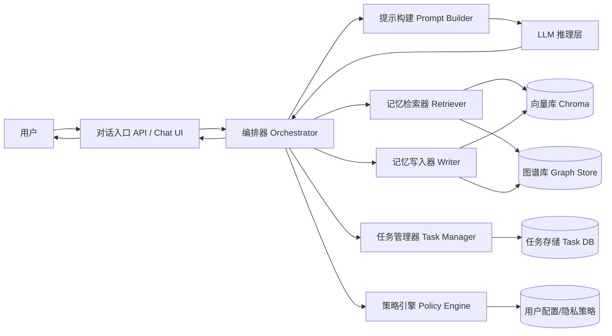
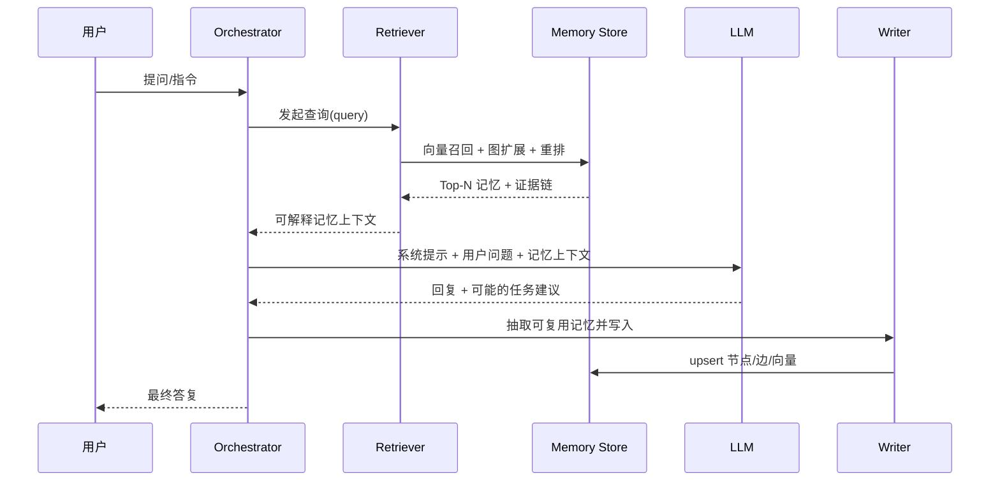
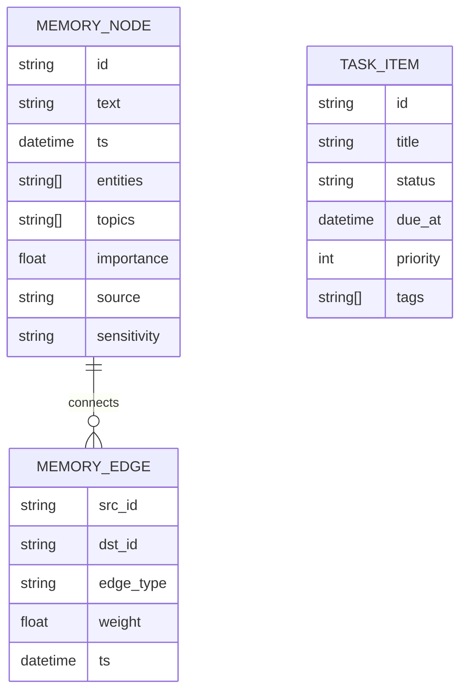
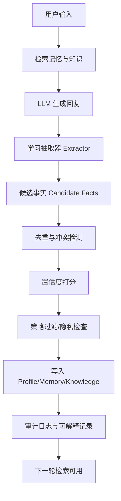

# 定制化 AI 秘书架构图与设计方案

## 1. 目标与范围

目标：打造一个“像现实秘书一样”的 AI 助手，通过持续对话逐步了解用户，并在后续任务中提供稳定、个性化、可追溯的协助。

范围：
- 对话记忆与长期画像
- 任务与日程跟踪
- 个性化响应与主动提醒
- 隐私可控（可查、可删、可禁写）

## 2. 总体架构图



## 3. 记忆与决策流程



## 4. 模块设计

1. 对话入口层（API/UI）
- 接收用户消息，透传会话元数据（用户、时间、渠道）。
- 提供记忆管理命令：`/memory list`、`/memory delete`、`/memory off`。

2. 编排器（Orchestrator）
- 统一调度检索、提示构建、LLM 调用、写回记忆。
- 负责超时控制、降级策略、错误恢复。

3. 记忆检索器（Retriever）
- 流程：向量召回 -> 图扩展 -> 多信号重排。
- 重排信号：语义分、关键词重合、图分、时效、重要性。
- 输出包含“入选原因”，用于可解释日志。

4. 记忆写入器（Writer）
- 从用户消息/模型回复/工具结果中抽取可复用信息。
- 写入 `MemoryNode`，并建立 `entity/semantic/temporal` 边。
- 支持去重合并与重要性阈值过滤。

5. 任务管理器（Task Manager）
- 管理待办、截止时间、优先级、依赖关系、状态迁移。
- 支持秘书式跟进：提醒、催办、下一步建议。

6. 策略与隐私引擎（Policy Engine）
- 控制哪些信息允许写入长期记忆。
- 支持分类禁写（如财务、医疗、私密对话）。
- 提供审计日志，满足可追溯与合规要求。

## 4.1 解耦边界设计（重点）

为保证“以后换模型时改动最小”，每层只依赖抽象接口，不直接依赖第三方 SDK：

1. 业务层（稳定）
- `Writer`、`Retriever` 仅依赖 `GraphStoreProtocol`、`VectorStoreProtocol`。
- 不直接 import Chroma/OpenAI/HuggingFace。

2. 适配层（可替换）
- Embedding 适配器：`Hash` / `HuggingFace` / `OpenAI`。
- 向量库适配器：`ChromaVectorStore` / `HashVectorStore`（后续可扩展 FAISS、PGVector）。

3. 装配层（单点配置）
- 工厂 `build_memory_stack_from_env()` 负责依赖注入。
- 切换模型或后端只改 `.env` 或工厂映射，不改业务层代码。

4. 替换示例
- 从 HuggingFace 切到 OpenAI：改 `MAMGA_EMBED_PROVIDER` 和 `MAMGA_EMBED_MODEL`。
- 从 Chroma 切到其他后端：新增 `XXXVectorStore` 并在工厂注册。

## 5. 数据模型（MVP）



## 6. 关键机制（秘书能力的核心）

1. 个性化画像
- 维护稳定偏好（语言、风格、工作节奏、决策习惯）。
- 画像优先级高于普通记忆，在 Prompt 中固定注入。

2. 长期记忆治理
- 去重：语义近似 + 实体重合。
- 衰减：长期未命中记忆降权。
- 压缩：周期性聚类摘要，减少冗余与成本。

3. 主动服务
- 基于任务截止时间和上下文触发提醒。
- 结合历史执行表现给出“可执行下一步”。

4. 可控性
- 用户可查看、删除、禁写指定类别记忆。
- 每条记忆可追溯来源（用户/模型/工具）。

## 7. 接口草案（示例）

```text
POST /chat
POST /memory/write
POST /memory/search
GET  /memory/list
POST /memory/delete
POST /memory/policy/update
POST /tasks/upsert
GET  /tasks/list
```

## 8. 分阶段实施计划

分阶段计划已拆分到独立文档，便于持续迭代维护：

- `docs/phases/README.md`

## 9. 成功指标（建议）

- 记忆命中准确率：用户认为“相关”的召回占比
- 任务跟进完成率：被提醒任务按期推进比例
- 交互效率提升：同类问题重复解释次数下降
- 用户主观满意度：个性化与可靠性评分

## 10. 与当前代码的映射

- 记忆结构：`memory/schemas.py`
- 写入逻辑：`memory/writer.py`
- 检索与重排：`memory/retriever.py`
- 可解释输出：`memory/assembler.py`
- 演示入口：`demo_mamga.py`

## 11. V1 自学习设计（用户画像 + 知识库增长）

### 11.1 设计目标

1. 通过日常聊天持续学习用户偏好与习惯（个性化）
2. 从对话与工具结果中沉淀可复用事实（知识增长）
3. 对错误记忆支持纠错回写（可演进）
4. 保持模型可替换性（业务层不依赖具体模型 SDK）

### 11.2 学习闭环（每轮对话）



### 11.3 三类学习对象

1. 用户画像（ProfileFact）
- 示例：偏好中文、偏好简洁步骤、常用技术栈、沟通语气
- 特点：稳定、复用率高、优先注入 Prompt

2. 任务事实（TaskFact）
- 示例：截止时间、当前进展、下一步动作、阻塞项
- 特点：生命周期强，状态变化频繁

3. 知识事实（KnowledgeFact）
- 示例：配置方法、问题修复结论、经验规则
- 特点：需要来源与置信度，支持冲突合并

### 11.4 数据结构建议

```text
ProfileFact:
- id, key, value, confidence, source, ts, status

KnowledgeFact:
- id, topic, statement, evidence[], confidence, version, ts, status

LearningEvent:
- id, input_ref, output_ref, extracted_ids[], action(upsert/merge/reject), reason, ts
```

### 11.5 抽取与校验策略

1. 抽取（Extractor）
- 输入：`user_message + assistant_message + tool_outputs`
- 输出：结构化候选事实（含类别与证据）

2. 去重（Deduper）
- 语义近似 + 键值相同 + 实体重合
- 重复项合并，保留更高置信度与更新版本

3. 冲突检测（Conflict Resolver）
- 同一键（如 `response_style`）出现不同值时，按规则处理：
  - 新证据更强则覆盖
  - 否则并存并降低置信度，等待用户反馈确认

4. 置信度更新
- 首次写入：由抽取器给初值
- 后续命中且被用户认可：上调
- 被用户纠错：下调或置为失效

### 11.6 检索注入策略

1. Prompt 固定注入：高置信 ProfileFact（如语言偏好）
2. Query 检索注入：与问题相关的 Memory/Knowledge 条目
3. 限额注入：每类 Top-N，避免上下文污染

### 11.7 用户可控机制（必须）

1. 查看：`/profile list`、`/knowledge list`
2. 删除：`/profile delete <id>`、`/knowledge delete <id>`
3. 禁写：`/memory off <category>`
4. 纠错：`/feedback correct <id> <new_value>`

### 11.8 解耦接口（面向替换）

```text
ExtractorProtocol.extract(messages, tool_outputs) -> CandidateFacts
DeduperProtocol.merge(candidates, existing) -> Upserts
PolicyProtocol.allow(candidate, user_policy) -> bool
ProfileStoreProtocol.upsert/list/delete(...)
KnowledgeStoreProtocol.upsert/search/delete(...)
FeedbackProtocol.apply(feedback_event) -> UpdateActions
```

说明：
- 抽取器可替换（规则版 / LLM 版）
- 知识库存储可替换（SQLite / Postgres / 文档库）
- 向量库和模型替换不影响业务流程

### 11.9 V1 落地范围（建议）

1. 先实现 `ProfileFact + KnowledgeFact` 入库与检索
2. 实现 `/profile list`、`/knowledge list`、`/feedback correct`
3. 实现最小置信度机制与冲突合并规则
4. 将高置信画像自动注入 Prompt（中文、风格、长度偏好）
5. 存储默认采用 SQLite 持久化，保留内存后端用于测试和降级
