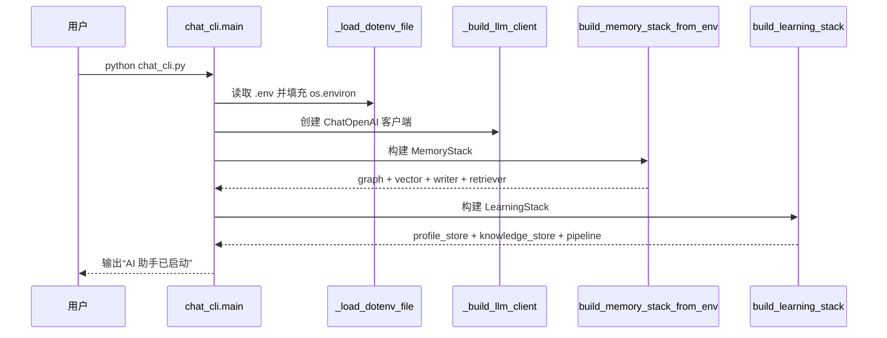
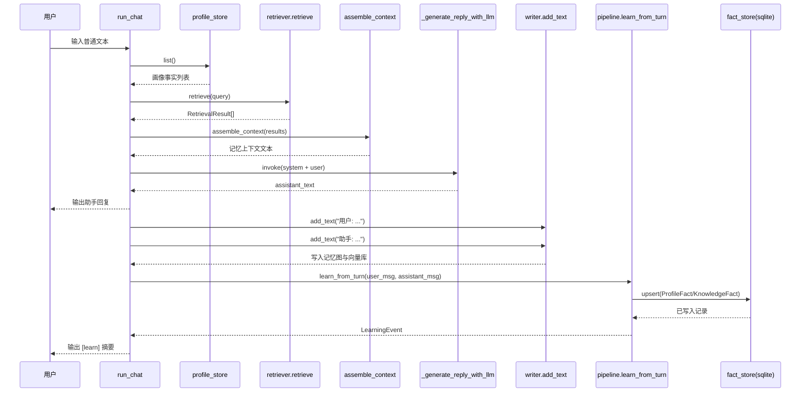
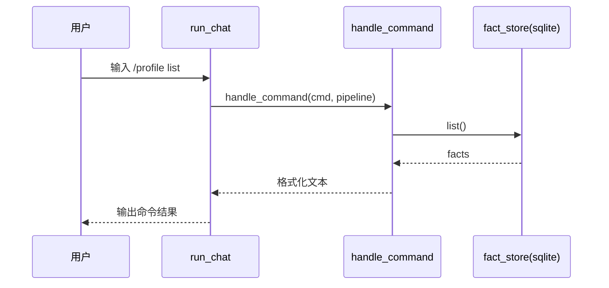
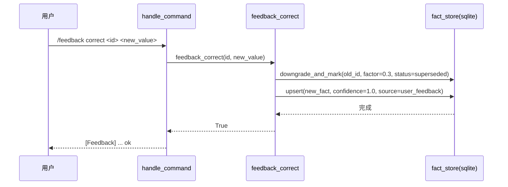

# 函数调用时序图（启动 + 单轮对话）

## 1. 启动阶段

### 关键函数

1. `chat_cli.main()`
2. `chat_cli._load_dotenv_file()`
3. `chat_cli._build_llm_client()`
4. `memory.factory.build_memory_stack_from_env()`
5. `memory.learning_factory.build_learning_stack()`

## 2. 单轮普通对话阶段

### 关键函数

1. `chat_cli.run_chat()`
2. `memory.retriever.HybridRetriever.retrieve()`
3. `memory.assembler.assemble_context()`
4. `chat_cli._generate_reply_with_llm()`
5. `memory.writer.MemoryWriter.add_text()`
6. `memory.learning.LearningPipeline.learn_from_turn()`

## 3. 单轮命令对话阶段（`/profile list` 等）

## 4. 纠错回调阶段（`/feedback correct`）

## 5. 代码定位索引

1. `chat_cli.py`
2. `memory/core/factory.py`
3. `memory/core/learning_factory.py`
4. `memory/retrieval/retriever.py`
5. `memory/graph/writer.py`
6. `memory/learning/pipeline.py`
7. `memory/facts/sqlite_store.py`
8. `memory/learning/commands.py`
