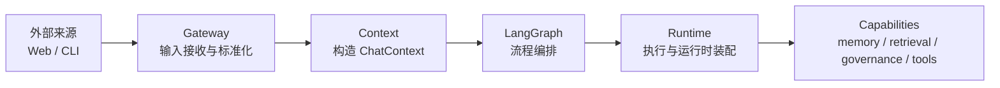
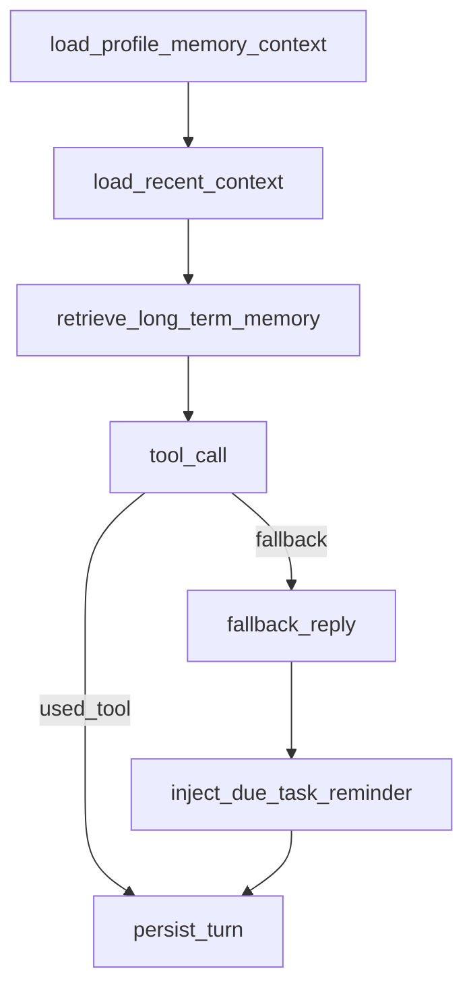

# 分层架构与主流程

当前项目按如下主链分层：



## 1. 各层职责

### 1.1 Gateway

职责：
- 接收外部来源输入
- 统一成内部可消费的标准输入
- 不直接持有底层能力实现细节

当前来源：
- Web：文本请求、语音上传
- CLI：终端文本输入

建议原则：
- gateway 不负责业务决策
- gateway 不直接调用 capability
- gateway 只做输入适配与边界隔离

### 1.2 Context

职责：
- 根据标准输入和依赖构造 `ChatContext`
- 组织三类记忆上下文：
  - 画像记忆
  - 短期记忆
  - 长期记忆
- 为 LangGraph 提供统一上下文访问入口

当前核心对象：
- `context/chat_context.py`

### 1.3 LangGraph

职责：
- 只负责流程编排
- 定义执行顺序、分支和状态流转

当前主链大致为：



LangGraph 回答的问题是：
- 这一轮先做什么
- 下一步走哪条分支

它不回答：
- 工具怎么执行
- 检索怎么打分
- 记忆怎么落库

### 1.4 Runtime

职责：
- 承接 LangGraph 后的执行动作
- 负责运行时装配
- 调用具体 capability 完成动作

典型内容：
- 工具调用执行
- LLM 客户端初始化
- memory stack 装配
- 对话写回
- Web 侧 ASR、提醒通知等运行时能力

核心原则：
- LangGraph 不直接碰 capability 细节
- Runtime 负责把流程节点真正执行下去

### 1.5 Capabilities

职责：
- 提供底层业务能力

当前主要包括：
- `capabilities/memory/`
- `capabilities/retrieval/`
- `runtime/tools/` 对应的底层事实/提醒/画像能力

这一层不关心入口来自 Web 还是 CLI，也不关心 LangGraph 节点顺序。

## 2. 当前推荐调用链

### 2.1 文本聊天

```text
Web/CLI 输入
-> Gateway 标准化文本输入
-> Context 构造 ChatContext
-> LangGraph 编排节点执行
-> Runtime 执行工具/写回
-> Capabilities 提供检索、记忆、治理、工具能力
```

### 2.2 语音聊天

```text
Web 上传音频
-> Gateway 接收音频输入
-> Runtime 执行 ASR
-> 生成标准文本输入
-> Context
-> LangGraph
-> Runtime
-> Capabilities
```

## 3. 设计落点

当前代码上的职责建议：

- `web_app.py` / `chat_cli.py`
  只保留入口 I/O
- `gateway/`
  只保留输入适配和入口规范化
- `context/`
  负责上下文组织
- `workflow/`
  负责流程编排
- `runtime/`
  负责运行时装配与执行
- `capabilities/`
  负责底层能力实现

## 4. 后续演进方向

如果未来新增来源（如 WeChat、Slack、定时任务、Agent API）：

- 新来源只新增 gateway adapter
- 复用同一套 context
- 复用同一套 LangGraph
- 复用同一套 runtime
- 复用同一套 capabilities

这样新增来源不会复制整套业务主链。
